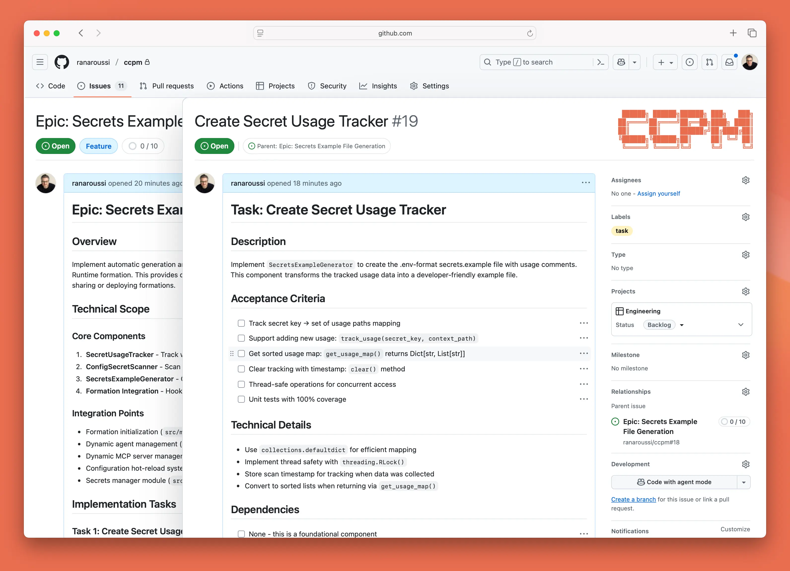
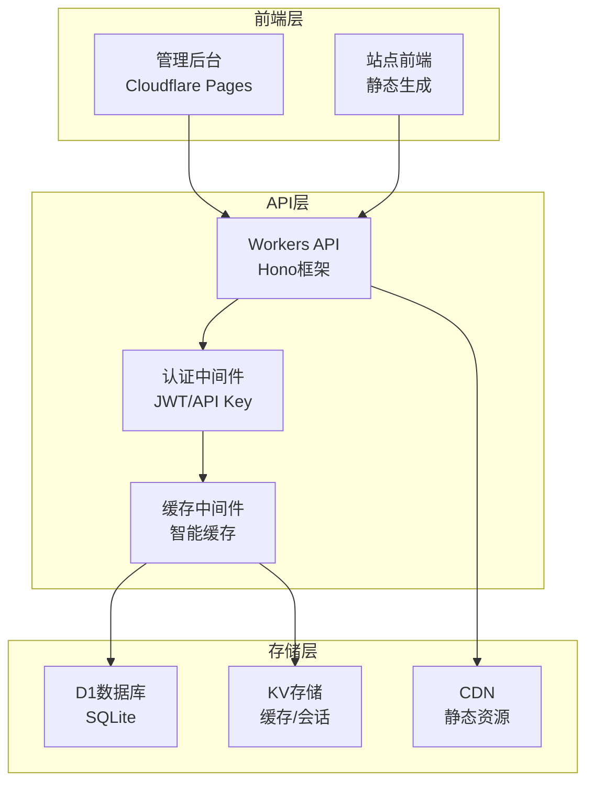

# Multi-Site CMS 多站点内容管理系统



基于Cloudflare全家桶构建的现代化多站点CMS系统，支持管理数十个独立网站，提供完整的内容管理、SEO优化、图片生成和自动化发布功能。

[](https://github.com/your-org/cms2/actions)
[](https://codecov.io/gh/your-org/cms2)
[](LICENSE)
[](package.json)

## ✨ 核心特性

### 🏢 多站点管理
- 一套系统管理数十个独立网站
- 每个站点独立域名、设置和内容
- 统一的管理界面，支持批量操作
- 灵活的权限控制和用户管理

### 📝 智能内容管理
- 强大的Markdown编辑器，支持实时预览
- 智能标签系统和内容分类
- 文章状态管理（草稿、发布、归档）
- 批量导入导出功能

### 🔍 SEO优化套件
- 自动生成sitemap.xml和robots.txt
- 内置SEO分析工具，提供优化建议
- 结构化数据支持，提升搜索可见性
- 关键词密度分析和建议

### 🖼️ 动态图片生成
- API驱动的图片生成服务
- 多种预设模板（社交媒体、博客、缩略图）
- 自定义样式和品牌元素
- 自动优化和CDN分发

### ⚡ 边缘计算架构
- 基于Cloudflare Workers，全球加速
- 毫秒级响应时间
- 智能缓存策略
- 99.9%+ 可用性保证

### 💰 成本效益
- 利用Cloudflare免费和低成本服务
- 按需付费，无固定服务器成本
- 自动扩缩容，处理突发流量
- 透明的价格结构

## 📖 目录

- [快速开始](#-快速开始)
- [系统架构](#-系统架构)
- [功能演示](#-功能演示)
- [安装部署](#-安装部署)
- [开发指南](#-开发指南)
- [API文档](#-api文档)
- [测试](#-测试)
- [部署](#-部署)
- [贡献指南](#-贡献指南)
- [许可证](#-许可证)

## 🚀 快速开始

### 在线演示

🌐 **演示地址**: [https://cms-demo.yourdomain.com](https://cms-demo.yourdomain.com)

- **管理后台**: https://cms-demo.yourdomain.com/admin
- **API文档**: https://cms-demo.yourdomain.com/docs
- **示例站点**: https://blog-demo.yourdomain.com

**演示账号**:
- 用户名: `demo@example.com`
- 密码: `demo123456`

### 本地快速体验

```bash
# 克隆项目
git clone https://github.com/hueshu/cms2.git
cd cms2

# 安装依赖
cd cf-cms-worker && npm install
cd ../cf-cms-site && npm install

# 启动开发环境
cd cf-cms-worker && npm run dev &
cd ../cf-cms-site && npm run dev

# 访问管理界面
open http://localhost:3000/admin
```

## 🏗 系统架构

### 技术栈



### 核心组件

| 组件 | 技术 | 功能 |
|------|------|------|
| **API服务** | Cloudflare Workers + Hono | REST API、认证、业务逻辑 |
| **前端界面** | Cloudflare Pages + Vite | 管理后台、用户界面 |
| **数据库** | Cloudflare D1 (SQLite) | 结构化数据存储 |
| **缓存** | Cloudflare KV | 缓存、会话、配置 |
| **CDN** | Cloudflare CDN | 静态资源分发 |
| **图片服务** | Workers + Canvas API | 动态图片生成 |

### 部署架构

```
┌─────────────────┐    ┌──────────────────┐    ┌─────────────────┐
│   全球用户       │────│   Cloudflare     │────│   源站服务       │
│                 │    │   Edge Network   │    │                 │
└─────────────────┘    └──────────────────┘    └─────────────────┘
                              │
                    ┌─────────┼─────────┐
                    │         │         │
            ┌───────▼───┐ ┌───▼───┐ ┌───▼─────┐
            │ Workers   │ │ Pages │ │ D1 + KV │
            │ API服务   │ │ 前端  │ │ 数据存储 │
            └───────────┘ └───────┘ └─────────┘
```

## 🎬 功能演示

### 站点管理演示

```bash
# 创建站点
curl -X POST https://api.yourdomain.com/api/v1/sites \
  -H "Authorization: Bearer $TOKEN" \
  -H "Content-Type: application/json" \
  -d '{
    "name": "我的博客",
    "domain": "myblog.com",
    "description": "个人技术博客",
    "settings": {
      "theme": "modern",
      "seo": {
        "title": "我的技术博客",
        "description": "分享编程技术和生活感悟"
      }
    }
  }'
```

### 内容发布演示

```bash
# 发布文章
curl -X POST https://api.yourdomain.com/api/v1/articles/site-123 \
  -H "X-API-Key: $API_KEY" \
  -H "Content-Type: application/json" \
  -d '{
    "title": "我的第一篇文章",
    "content": "# 欢迎来到我的博客\n\n这是我的第一篇文章...",
    "status": "published",
    "tags": ["技术", "博客"],
    "seo": {
      "title": "我的第一篇文章 - 技术博客",
      "description": "这是我在新博客上发布的第一篇文章"
    }
  }'
```

### 图片生成演示

```bash
# 生成社交媒体图片
curl -X POST https://api.yourdomain.com/api/v1/images/generate \
  -H "Content-Type: application/json" \
  -d '{
    "text": "我的第一篇文章",
    "template": "social",
    "width": 1200,
    "height": 630,
    "backgroundColor": "#007bff",
    "fontColor": "#ffffff"
  }' --output article-cover.png
```

## 📦 安装部署

### 环境要求

- **Node.js**: 18.0+
- **npm**: 8.0+
- **Cloudflare账号**: 免费计划即可开始
- **域名**: 可选，用于自定义域名

### 1. 克隆项目

```bash
git clone https://github.com/hueshu/cms2.git
cd cms2
```

### 2. 安装依赖

```bash
# 安装Workers依赖
cd cf-cms-worker
npm install

# 安装Pages依赖
cd ../cf-cms-site
npm install

# 返回根目录
cd ..
```

### 3. 配置Cloudflare

```bash
# 安装Wrangler CLI
npm install -g wrangler

# 登录Cloudflare
wrangler auth login

# 创建D1数据库
cd cf-cms-worker
wrangler d1 create cms-production

# 创建KV命名空间
wrangler kv:namespace create "CACHE_KV"
```

### 4. 配置环境变量

编辑 `cf-cms-worker/wrangler.toml`:

```toml
name = "cf-cms-worker"
main = "src/index.ts"
compatibility_date = "2024-01-01"

[[d1_databases]]
binding = "DB"
database_name = "cms-production"
database_id = "你的数据库ID"

[[kv_namespaces]]
binding = "CACHE_KV"
id = "你的KV命名空间ID"

[vars]
ENVIRONMENT = "production"
```

设置密钥:

```bash
# JWT密钥
wrangler secret put JWT_SECRET

# Cloudflare API令牌（可选）
wrangler secret put CLOUDFLARE_API_TOKEN
```

### 5. 初始化数据库

```bash
# 执行数据库迁移
wrangler d1 execute cms-production --file=./src/schema.sql
```

### 6. 部署应用

```bash
# 部署Workers
cd cf-cms-worker
npm run deploy

# 部署Pages
cd ../cf-cms-site
npm run build
wrangler pages project create cms-frontend
wrangler pages deploy dist --project-name=cms-frontend
```

详细部署指南请参考 [部署文档](docs/DEPLOYMENT.md)。

## 🛠 开发指南

### 开发环境设置

```bash
# 启动Workers开发服务器
cd cf-cms-worker
npm run dev

# 启动Pages开发服务器
cd cf-cms-site
npm run dev
```

### 项目结构

```
cms2/
├── cf-cms-worker/          # Workers后端服务
│   ├── src/
│   │   ├── api/           # API路由
│   │   ├── middleware/    # 中间件
│   │   ├── services/      # 业务服务
│   │   ├── models/        # 数据模型
│   │   └── utils/         # 工具函数
│   ├── wrangler.toml      # Workers配置
│   └── package.json
│
├── cf-cms-site/           # Pages前端
│   ├── src/
│   │   ├── components/    # Vue组件
│   │   ├── pages/         # 页面
│   │   ├── stores/        # 状态管理
│   │   └── utils/         # 工具函数
│   ├── vite.config.ts     # Vite配置
│   └── package.json
│
├── docs/                  # 文档
│   ├── API.md            # API文档
│   ├── DEPLOYMENT.md     # 部署指南
│   ├── USER_GUIDE.md     # 用户指南
│   └── TROUBLESHOOTING.md # 故障排查
│
├── test-suites/          # 测试套件
│   ├── api-tests.ts      # API测试
│   └── e2e-tests.ts      # 端到端测试
│
└── .github/workflows/    # CI/CD配置
    └── test.yml          # 测试流程
```

### 代码规范

- **TypeScript**: 严格类型检查
- **ESLint**: 代码质量检查
- **Prettier**: 代码格式化
- **Vitest**: 单元测试
- **Conventional Commits**: 提交信息规范

## 📚 API文档

完整的API文档请参考：

- **在线文档**: [docs/API.md](docs/API.md)
- **Swagger UI**: https://api.yourdomain.com/docs
- **Postman集合**: [导入链接](https://api.yourdomain.com/postman.json)

### 快速API示例

```javascript
// 认证
const response = await fetch('/api/v1/auth/login', {
  method: 'POST',
  headers: { 'Content-Type': 'application/json' },
  body: JSON.stringify({
    email: 'user@example.com',
    password: 'password123'
  })
})

const { token } = await response.json()

// 获取站点列表
const sites = await fetch('/api/v1/sites', {
  headers: { 'Authorization': `Bearer ${token}` }
})

// 创建文章
const article = await fetch('/api/v1/articles/site-id', {
  method: 'POST',
  headers: {
    'X-API-Key': 'your-api-key',
    'Content-Type': 'application/json'
  },
  body: JSON.stringify({
    title: '文章标题',
    content: '文章内容...',
    status: 'published'
  })
})
```

## 🧪 测试

### 运行测试

```bash
# 单元测试
cd cf-cms-worker
npm test

# API集成测试
npm run test:api

# 端到端测试
npm run test:e2e

# 性能测试
npm run test:performance

# 测试覆盖率
npm run test:coverage
```

### 测试类型

- **单元测试**: 服务、工具函数、中间件
- **集成测试**: API端点、数据库操作
- **端到端测试**: 完整用户流程
- **性能测试**: 负载和压力测试
- **安全测试**: 漏洞扫描和安全检查

测试套件详情请查看 [测试文档](test-suites/)。

## 🚀 部署

### 自动部署

项目配置了完整的CI/CD流程：

- **代码推送**: 自动触发测试和部署
- **Pull Request**: 自动运行测试套件
- **主分支**: 自动部署到生产环境
- **开发分支**: 自动部署到测试环境

### 手动部署

```bash
# 部署到生产环境
npm run deploy:production

# 部署到测试环境
npm run deploy:staging

# 仅部署Workers
npm run deploy:worker

# 仅部署Pages
npm run deploy:pages
```

### 环境管理

- **开发环境**: `npm run dev`
- **测试环境**: https://cms-staging.yourdomain.com
- **生产环境**: https://cms.yourdomain.com

详细部署说明请参考 [部署指南](docs/DEPLOYMENT.md)。

## 🤝 贡献指南

我们欢迎所有形式的贡献！

### 贡献方式

1. **报告问题**: [提交Issue](https://github.com/hueshu/cms2/issues)
2. **功能建议**: [功能请求](https://github.com/hueshu/cms2/issues/new?template=feature_request.md)
3. **代码贡献**: [提交Pull Request](https://github.com/hueshu/cms2/pulls)
4. **文档改进**: 完善文档和示例

### 开发流程

1. Fork项目到您的GitHub账号
2. 创建功能分支: `git checkout -b feature/amazing-feature`
3. 提交更改: `git commit -m 'Add amazing feature'`
4. 推送分支: `git push origin feature/amazing-feature`
5. 创建Pull Request

### 代码贡献规范

- 遵循现有代码风格
- 添加适当的测试用例
- 更新相关文档
- 确保所有测试通过

## 📄 许可证

本项目采用 [MIT 许可证](LICENSE)。

## 🆘 支持

### 获取帮助

- **文档**: [用户指南](docs/USER_GUIDE.md) | [API文档](docs/API.md)
- **问题反馈**: [GitHub Issues](https://github.com/hueshu/cms2/issues)
- **讨论交流**: [GitHub Discussions](https://github.com/hueshu/cms2/discussions)
- **邮件支持**: support@yourdomain.com

### 社区

- **官方网站**: https://cms.yourdomain.com
- **博客**: https://blog.yourdomain.com
- **Twitter**: [@YourProject](https://twitter.com/yourproject)

---

## 📈 项目状态

- ✅ 多站点管理
- ✅ 内容管理系统
- ✅ SEO优化工具
- ✅ 图片生成服务
- ✅ API文档
- ✅ 测试套件
- 🚧 移动端管理界面
- 🚧 插件系统
- 🚧 多语言支持
- 📋 评论系统
- 📋 统计分析

---

**Built with ❤️ by [HueShu](https://github.com/hueshu)**

*如果这个项目对您有帮助，请给我们一个 ⭐️ 支持！*
